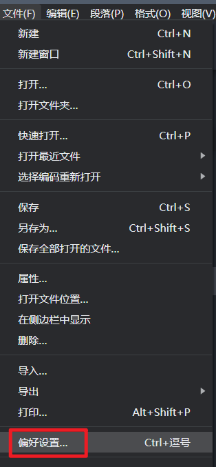
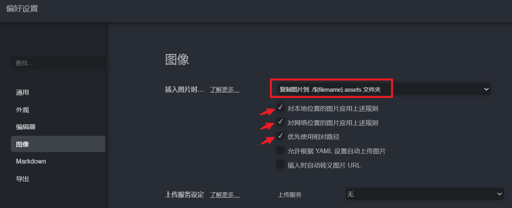

# WORKNOTE

## 笔记列表：

### [Vic note](https://github.com/vicici315/worknote/blob/main/worknote.md)

### [KK note](https://github.com/vicici315/worknote/blob/main/WN_kk.md)

### [Cinne note](https://github.com/vicici315/worknote/blob/main/WN_cinne.md)

## 笔记编写前先设置Typora软件的图片存储位置规范

做如下设置：

