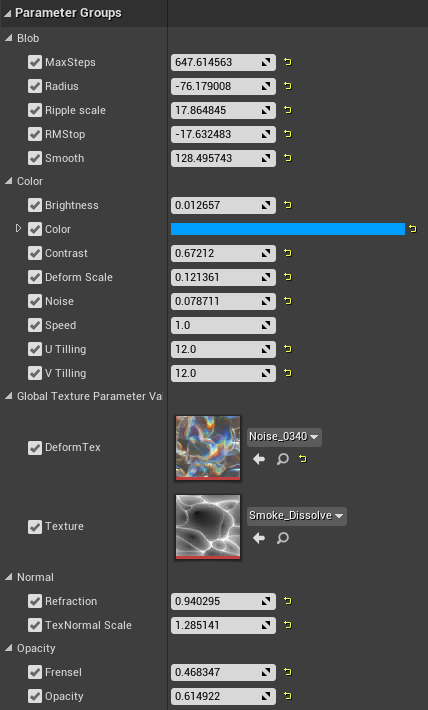
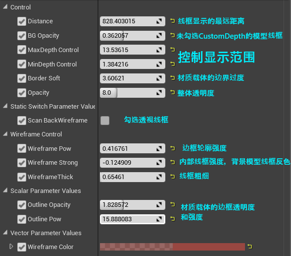
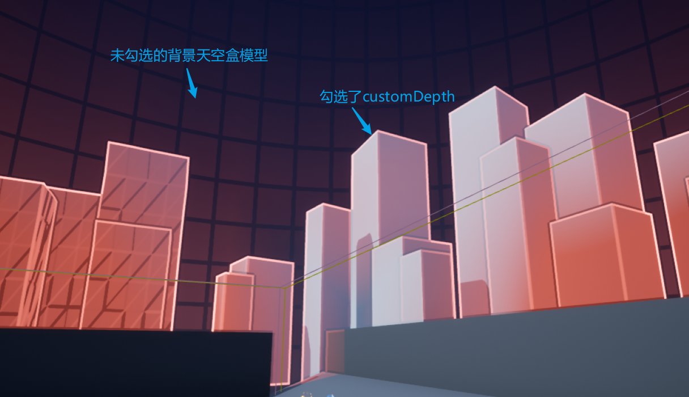
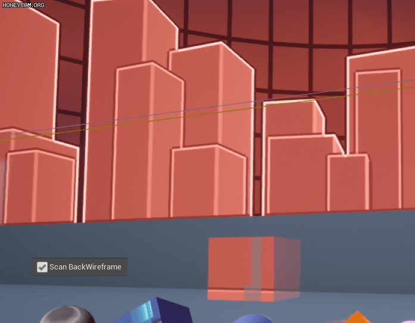
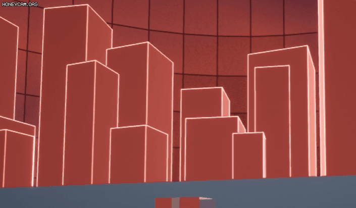
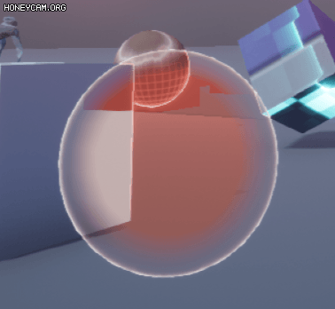
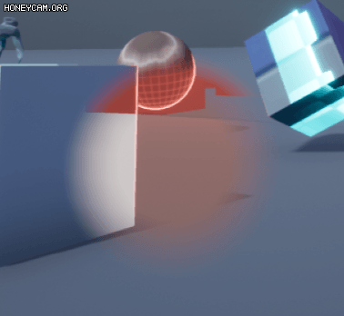
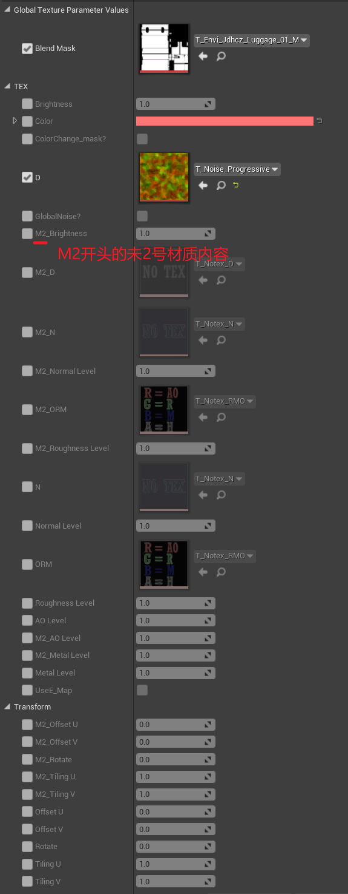

# 材质笔记

## 特效材质

### 水球结界特效材质

材质名：M_Blob

### 透过模型的后处理线框材质

材质名：

* Scan BackWireframe
  

* Wireframe Strong
  

* BG Opacity
  
* Outline Opacity 和 Outline Pow
  

## 场景材质

### 场景混合材质

材质名：M_PM_BlendMaster_01

M2_开头的属性为第二套材质的参数，Blend Mask 的 R 通道作为蒙版贴图，目前使用第1套UV。

